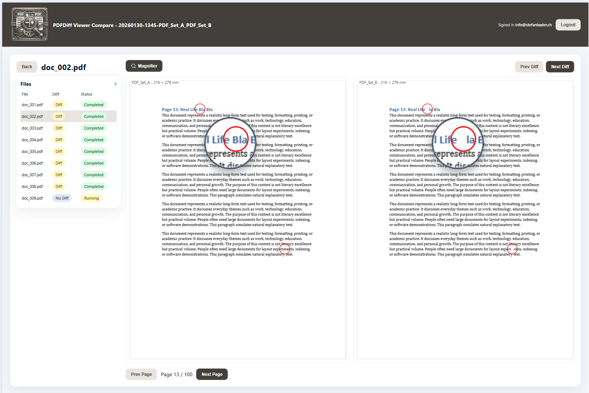
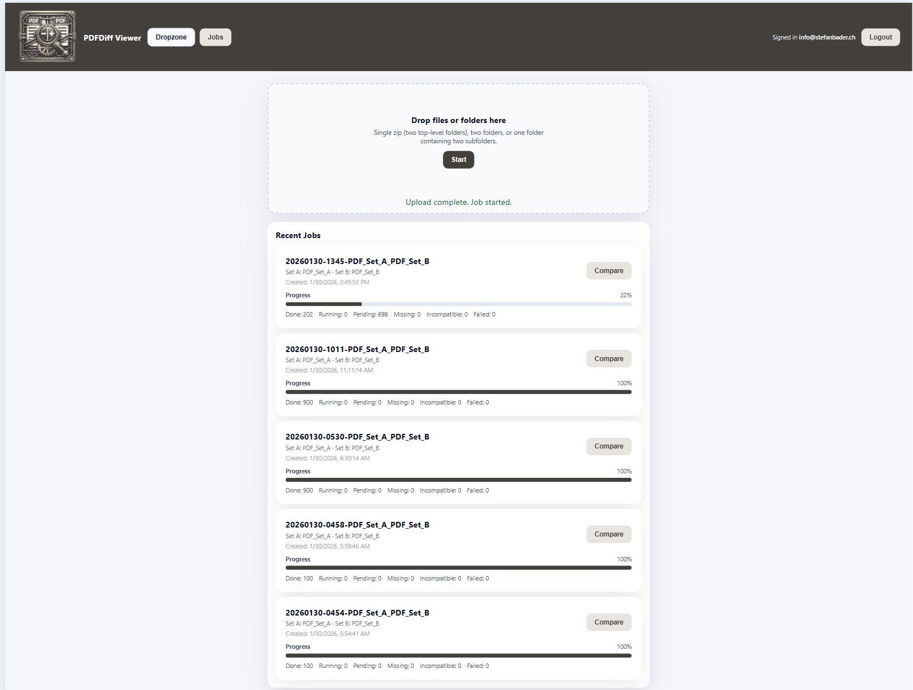

# PDFDiff Turbo

This tool compares two PDF sets by rendering pages and performing pixel-level image diffs. It was built in relaxed “vibe coding” sessions using VS Code together with GitHub Copilot to streamline development.




[Comparison Report (PDF)](./Project/Documentation/comparison-report.pdf)

## Features
- **Pixel-level visual diff**: OpenCV-based comparison highlights even subtle changes
- **Interactive magnifier**: Toggle zoom lens to inspect differences in detail (2.5x magnification)
- **Responsive viewer**: PDFs scale dynamically to fit browser window
- **Real-time updates**: WebSocket connections show live job progress
- **Navigation controls**: Jump between differences with Prev/Next buttons
- **Side-by-side comparison**: View Set A and Set B PDFs with synchronized scrolling
- **Job management**: Track multiple comparison jobs with status updates

## Architecture
- API: FastAPI (async SQLAlchemy)
- Worker: Celery tasks with PyMuPDF rendering + OpenCV diff
- Storage: Shared container volume mounted at `/data`
- UIs: Angular (viewer + admin) served by Nginx

## Container Runtime Preference
This project is intended to be started with Podman Compose (use `podman compose ...`).

## Quick Start (Podman)
1. Start stack:
   - `podman compose up --build`
2. Run migrations:
   - `podman compose exec api alembic upgrade head`
3. Seed users:
   - `podman compose exec api python -m app.seed.seed_users`

Podman (Windows) install hint:
- `winget install -e --id RedHat.Podman`

Defaults (override with env vars below):
- Admin: `admin@example.com` / `admin123`
- User: `user@example.com` / `user123`

## Environment Variables
API/Worker:
- `DATABASE_URL` (default set in docker-compose)
- `CELERY_BROKER_URL`
- `CELERY_RESULT_BACKEND`
- `JWT_SECRET`
- `RENDER_DPI`
- `DIFF_THRESHOLD`
- `SEED_ADMIN_EMAIL`, `SEED_ADMIN_PASSWORD`
- `SEED_USER_EMAIL`, `SEED_USER_PASSWORD`

## Endpoints (Core)
- Auth: `/auth/register`, `/auth/login`, `/auth/refresh`, `/auth/logout`, `/auth/me`
- Jobs: `/jobs`, `/jobs/{job_id}/upload`, `/jobs/{job_id}/start`
- Job status: `/jobs/{job_id}`
- Files/pages: `/jobs/{job_id}/files`, `/jobs/{job_id}/files/{file_id}/pages`
- Artifacts: `/jobs/{job_id}/files/{file_id}/pages/{page_index}/overlay`
- PDF stream: `/jobs/{job_id}/files/{file_id}/content?set=A|B`
- Admin: `/admin/jobs`, `/admin/jobs/{job_id}/cancel`, `/admin/users`, `/admin/users/{user_id}`

## UIs
- Viewer: http://localhost:8080
- Admin: http://localhost:8081
- API: http://localhost:8000
- Flower: http://localhost:5555

## HTTPS (Self-signed, local)
1. Generate certs:
   - `python ./scripts/generate-dev-certs.py`
2. Start the stack as usual.
3. Open:
   - Viewer: https://localhost:8443
   - Admin: https://localhost:8444

## Scaling Notes
- Increase worker concurrency: update `celery worker --concurrency=N`.
- Add more worker replicas in podman compose or orchestration.
- Use a dedicated RabbitMQ and Postgres for production.
- Consider GPU-enabled workers for faster rendering if available.
- Move `/data` to a networked volume with high throughput for large PDFs.

## Data Layout
- Uploaded files: `/data/jobs/{job_id}/setA|setB/...`
- Overlays: `/data/jobs/{job_id}/artifacts/{file_id}/page_{page_index}.svg`

## Notes
- Incompatible page sizes are marked `incompatible_size` and have `diff_score=null`.
- Missing pages are tracked per file and per page.


## Disable flower
```
KUBECONFIG=/etc/rancher/k3s/k3s.yaml kubectl -n pdfdiff scale deployment flower --replicas=0
```